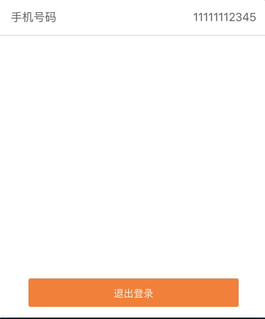

# react-native-material-btn

#### Install
`npm install react-native-material-btn --save`

#### Usage
```js
import MaterialBtn from 'react-native-material-btn'

render() {
  return (
     <View style={styles.logoutBtn}>
        <MaterialBtn
          rippleColor='rgba(255, 255, 255, 0.2)'
          style={{marginBottom: 10, padding: 15, backgroundColor: '#FF7421'}} 
        >
          <Text style={{ color: '#fff' }}>点击</Text>
        </MaterialBtn>
      </View>
  )
}
```

#### 属性

```
  withRipple (Boolean) - 是否显示动画效果，默认为true,
  withShadow (Boolean) - 是否显示阴影，默认为 false,
  shadowLevel (Number) - 未点击的时候阴影的圆角，默认 1,
  pressedShadowLevel (Number) - 点击的时候阴影的圆角 5,
  shadowColor (String) - 阴影的颜色，默认 #000，
  shadowOpacity (Number) - 未点击时候的阴影透明度，默认0.4,
  pressedShadowOpacity (Number) - 按钮点击的时候的阴影透明度，默认0.6,
  animationTime (Number) - 动画效果的时间 ,默认600ms
  rippleColor (String) - 动画效果的颜色,默认: rgba(0,0,0,0.1),
  styles (Object) - 按钮的样式,
```

#### 事件

```
  onPress: 点击按钮时候的回调
  onPressIn: 刚点击按钮时候的回调
  onPressOut: 刚点击完按钮之后的回调
```

#### DEMO


